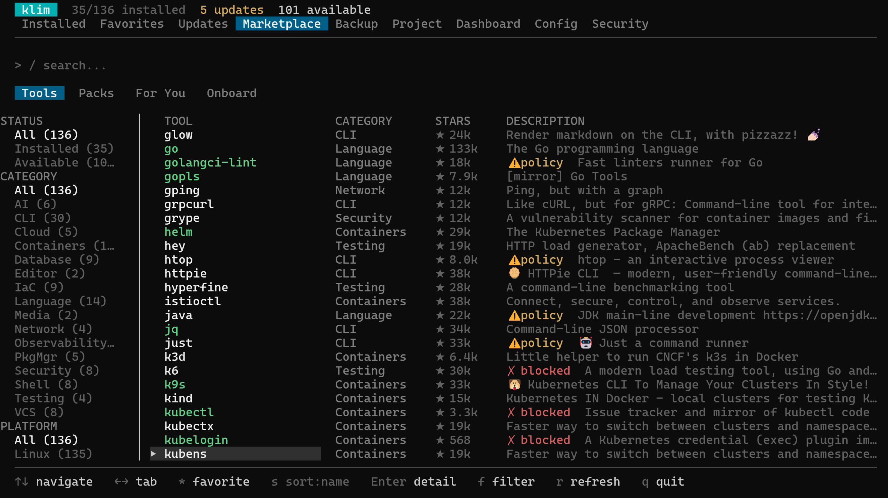
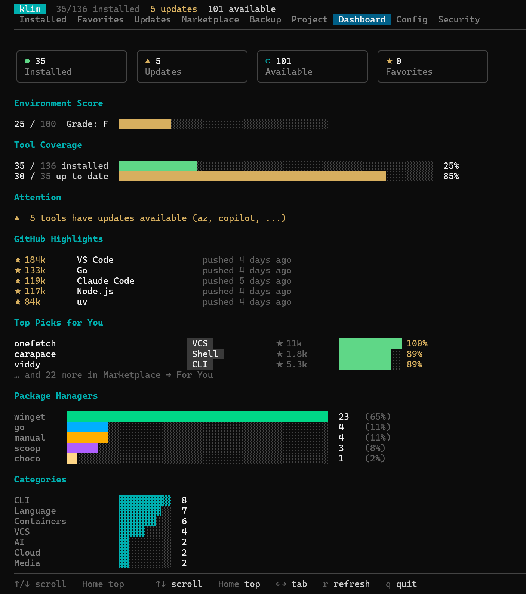

The Klim TUI is an interactive interface for your developer environment. Launch it by running `klim` with no arguments to inspect installed tools, project contracts, updates, health, backups, and configuration from one place.

## Tabs

The TUI has 9 parent tabs, accessible via arrow keys or number keys:

| Tab | Key | Purpose |
|-----|-----|---------|
| **My Tools** | 1 | All detected tools with version status (sub-tabs: Installed, Updates, Favorites) |
| **Marketplace** | 2 | Browse and install (sub-tabs: Tools, Packs, For You, Onboard) |
| **Project** | 3 | Multi-project `.klim.yaml` management |
| **Dashboard** | 4 | Stats, gauges, category breakdowns |
| **My Profile** | 5 | Generate / inspect / compare / apply env profile + the **My Score** breakdown (formerly Dashboard's Environment Score) |
| **Health** | 6 | Environment diagnostics and visual PATH-conflict explorer (sub-tabs: Issues, PATH) |
| **Security** | 7 | Security audit and policy compliance (sub-tabs: Audit, Compliance) |
| **Backup** | 8 | Export, import, share, custom packs, saved backups |
| **Config** | 9 | View and edit settings |

### Marketplace

Browse the full catalog with category, platform, and tag filters; sub-tabs cover individual **Tools**, curated **Packs**, personalised **For You** recommendations, and the role-based **Onboard** wizard.

### Project

Auto-detect required tools from `.github/`, `go.mod`, `package.json`, and friends. Press Enter to write `.klim.yaml`.

### Dashboard

A single page with tool coverage, attention items, GitHub highlights, top picks, package-manager mix, and category breakdown. (The environment score has moved to **My Profile → My Score**, which exposes the full per-category breakdown.)

### Security

Security audit and policy compliance grouped under one tab. Environment
health diagnostics now live in their own [Health](#health) tab.

### Health

Environment diagnostics and a visual PATH-conflict explorer. The
**Issues** sub-tab is the full diagnostic list (PATH problems,
multi-installs, missing PMs, stale cache). The **PATH** sub-tab
visualises which binary wins, which copies are shadowed, and where
versions diverge across copies — switch between *By tool* and
*By PATH dir* with `t`, and press `u` on a shadowed row to uninstall
that specific copy through its detected package manager.

## Global Keybindings

These work on every tab:

| Key | Action |
|-----|--------|
| `←` / `→` or `Tab` / `Shift+Tab` | Switch tabs (and sub-tabs on Marketplace / Health / Security / My Tools) |
| `1`–`9` | Jump to specific tab |
| `P` | Open the Plan modal (preview pending changes, apply, capture / restore checkpoints) |
| `r` | Refresh — rescan tools |
| `q` or `Ctrl+C` | Quit |

## Plan / apply / rollback workflow

Press `P` from any tab to open the Plan modal — the same preview `klim plan` emits, rendered inline. Available actions inside the modal:

| Key | Action |
|-----|--------|
| `a` | Apply the plan (shells out to `klim apply --yes` so the full checkpoint + postcheck wrapper still runs). |
| `c` | Capture a named checkpoint of the current toolchain. |
| `b` | Open the checkpoint browser. `↑↓` navigate, `Enter` previews the rollback plan, `d` deletes, `Esc` returns. |
| `r` | Rebuild the plan. |
| `↑↓ / PgUp / PgDn / Home` | Scroll. |
| `Esc / q` | Close. |

The full CLI surface (`klim plan`, `klim apply`, `klim checkpoint`, `klim rollback`) still works identically and remains the reference for CI / agent integration. See the reference pages:

- [`klim plan`](../reference/commands/plan.md) — preview pending changes with 0-100% upgrade confidence per change
- [`klim apply`](../reference/commands/apply.md) — execute, auto-checkpointed, post-validated
- [`klim checkpoint`](../reference/commands/checkpoint.md) — capture / list / show / delete named snapshots
- [`klim rollback`](../reference/commands/rollback.md) — produce a restore plan from a checkpoint

## Tool List Navigation

Used on Installed, Favorites, Updates, and Discover tabs:

| Key | Action |
|-----|--------|
| `↑` / `↓` | Navigate up / down |
| `Enter` | Open detail view |
| `*` | Toggle favorite |
| `s` | Toggle sort (name / stars) |
| `f` | Toggle filter sidebar |

## Filter Sidebar

Press `f` to toggle the filter sidebar. It provides filtering by:

- **Category** — Cloud, CLI, Containers, IaC, Security, etc.
- **Platform** — macOS, Linux, Windows
- **Tags** — automation, kubernetes, monitoring, etc.

Each filter shows a count of matching tools. The sidebar position (left/right) is configurable in `config.yaml` via `ui.sidebar_right`.

## Detail View

Press `Enter` on any tool to see its detail card:

- Display name and description
- Installed version and latest available version
- Install source (brew, winget, apt, etc.)
- Binary path
- Available package manager IDs
- Actions: Install, Upgrade, Remove

Press `Esc` to return to the list.

## Status Indicators

| Icon | Meaning |
|------|---------|
| ✓ | Up to date |
| ⬆ | Update available |
| ★ | Favorited |
| ⏳ | Version check in progress |

## Performance

Version resolution runs concurrently with a configurable semaphore (default: 4 concurrent queries). Package manager timeouts default to 30 seconds and can be adjusted in `config.yaml`.

On subsequent launches, klim uses a scan cache to skip PATH scanning and version resolution, making startup near-instant. Press `r` to force a fresh scan.
