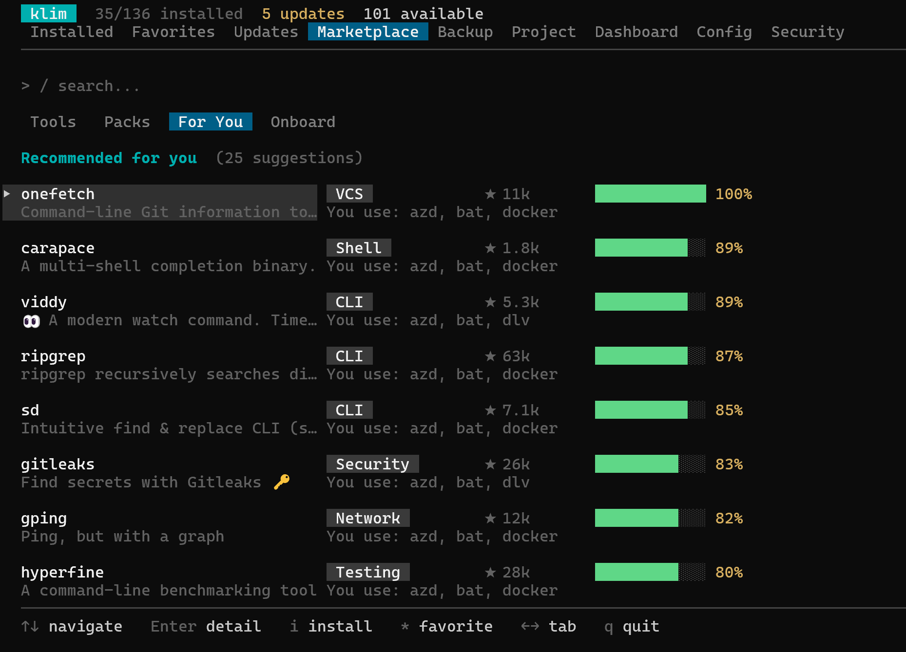

Interactive onboarding wizard that recommends tools based on what kind of development you do.



## Usage

```bash
klim onboard [role] [flags]
```

## Flags

| Flag | Description |
|------|-------------|
| `--list` | List recommended tools without installing |

## Available Roles

| Role | Description |
|------|-------------|
| `web` | Web Development (Frontend/Backend) |
| `devops` | DevOps / Cloud / Infrastructure |
| `data` | Data / ML / AI |
| `mobile` | Mobile Development (iOS/Android) |
| `systems` | Systems / Embedded / Low-level |
| `security` | Security / Pen-testing |

## Examples

```bash
# Interactive — shows role picker
klim onboard

# Recommend tools for DevOps
klim onboard devops

# Preview recommendations without installing
klim onboard web --list
```

## How It Works

1. Scores uninstalled marketplace tools by category and tag overlap with the selected role
2. Boosts tools with high GitHub star counts
3. Shows top 15 recommendations with descriptions
4. Optionally batch-installs all via the best available package manager

## See Also

- [Adding Tools guide](../../guides/adding-tools.mdx) — Browse and discover tools in the TUI
